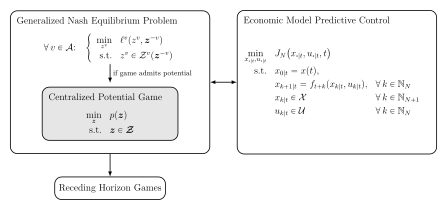

# Time-Varying RHGs

This repository contains the Python code that accompanies the master thesis:

> Erdin, Alexander “Stability of Time-Varying Receding Horizon Games”, 2025.



## Prerequisites

- Python 3.9
- Conda (optional)

## Installation

1. Download and install [Python](https://www.python.org/downloads/)
2. Create a [Conda](https://docs.anaconda.com/miniconda/miniconda-install/) environment to make sure all the necessary packages are installed

    ```bash
    conda env create --file environment.yml
    conda activate time-varying-rhgs
    ```

   or install the packages manually.
3. To update the environment later execute

    ```bash
    conda activate time-varying-rhgs
    conda env update --file environment.yml --prune
    ```

4. Clone this repository or download the code as a ZIP archive and extract it to a folder of your choice.

## Running Jupyter Notebooks

Start a jupyter notebook server by running

```bash
    jupyter notebook 
```

This requires that you have installed all the packages from `environment.yml`.

*Note: The notebooks cannot currently be run as-is because the original test data has been removed. The data will be replaced with new test data shortly. Thank you for your understanding.*

## License

This project is licensed under the MIT License.

## Citation

If you use this code in your research, please cite it:

```text
@article{erdin2025rhg,
  title={Stability of Time-Varying Receding Horizon Games},
  author={Erdin, Alexander},
  year={2025}
}
```
  
## Support and Contact

For any questions or issues related to this code, please contact the author:

- Alexander Erdin: aerdin(at)ethz(dot)ch

We appreciate any feedback, bug reports, or suggestions for improvements.
